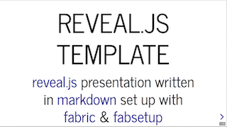
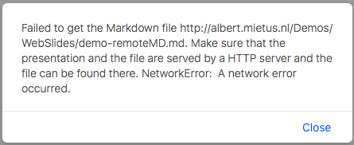

.. _remote-md:

=========
Remote MD
=========
.. Copyright (C) ALbert Mietus, 2018

.. post:: 2018/5/5
   :tags: revealjs
   :category: WebSlides, Experiment

   I try to create beautiful :ref:`webslides` by combining a :ref:`html-template <html-template>` with :ref:`md-content
   <md-content>`. Typically, they have the same filename (but for the extension) in the same directory (and site).

   In this blog, we are examining another option: Apparently it is possible to load a **remote MD-file**. This gives new options.
   By example: host a (generated) html-file on one cloud-provider and the md-file on another-one.

   **Unfortunately this setup is unstable:** It may work, and sometimes does; but it may fail too....

Ultimate, I would like to have all (source) files in a cloud-hosted version-controlled system as https://bitbucket.org.
And host the documentation on (eg) http://readthedocs.org. When possible, the WebSlides are (eventually) embedded in a `Sphinx
<http://www.sphinx-doc.org/en/master/>`_\-*build* html-file, which reads the md-file directly from (eg) bitbucket.

Setup
=====

The html-template is like usual, only the location of the md-file differs: fill in the URL to that file, as shown below.

.. literalinclude:: democode/demo-remoteMD.html
   :language: html
   :lines: 10
   :lineno-match:

This demo however, does *NOT* work!

Unstable
========

   The first try did work ...

An early try-out version worked however. I started with an existing md-file (on github) [#theno]_ with the (existing,
different) html-template copied to my local web-server. It worked! Enthusiastic, I modified the template into my *rst*-style
setup; still it loaded. Due a different setting of the data-separators [#data-separator]_, the slides were malformed.
But writing a new :ref:`md-content <md-content>` is easy... And I have some old (public) websevers, to show the
intermediate results for everbody.

So, I created the above :download:`democode/demo-remoteMD.html` example; with the md-file on my (old) http://albert.mietus.nl
server. And it fails:  A popup is shown saying it can’t load the md-file. Copying that URL, and open in manually
does work however. (Try if you like.)

   It doesn’t work, despite the md-file (http://albert.mietus.nl/Demos/WebSlides/demo-remoteMD.md) does exist and is
   (manually) loadable.

I tried several *in-between* alternatives. Even one loading the md-file of he first experiment, with
my :ref:`html-template <html-template>` [#data-separator]_. A ``diff`` showed  one changed line only: the URL of the
md-file; and serve that from the same (local) websever: **One works, the other not!**

Apparently, the site hosting the md-file has effect. An effect, I do not fully understand. But still ...

Good experiment: No-Go
======================

It was a nice experiment. With a clear conclusion:

This is a **No-Go**. Possible, it may be workable with a fixed, well-tuned set of servers. But it’s not generally
working. So, I will look for other options.

Feel free to comment.

----------

.. rubric:: Footnotes

.. [#theno]	On https://theno.github.io/revealjs_template/slides.html a similar demo is given. I tried the `slides.md
                <https://theno.github.io/revealjs_template/slides.md>`_.
.. [#data-separator]
		The “data-separators” in the html-template and the md-file should match. As I’m trying to stay
                as-close-as-possible to the rst-syntax & semantics, “my” regexps do not match the ones used in used
                md-file.

                Still, when the md-file is loaded, one can see result: one very long slide.
